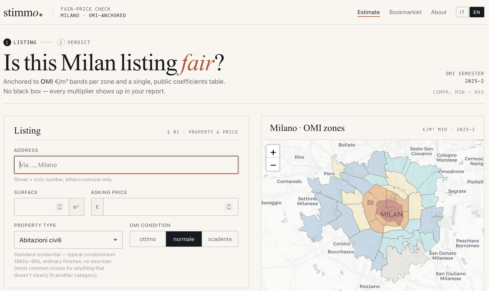

<p align="center">
  
</p>

# stimmo


**Is that Milan listing actually a fair price?**

stimmo checks the asking price of any Milan apartment against the official OMI €/m² band for its zone, property type, and condition — adjusting for floor, lift, energy class, outdoor space, and more. You get a verdict: **under-priced**, **fair**, or **over-priced**.

No ML, no black box. Every multiplier is a number in [one public coefficients file](src/stimmo/valuation/adjustments.py).



## Quickstart

```sh
uv sync
uv run stimmo-web        # → http://127.0.0.1:8000
```

Fill in the listing's address, surface, condition, and asking price. stimmo geocodes the address, looks up the OMI zone, runs the adjustments, and returns a verdict with a full breakdown and 8-semester price trend for the zone.

Override the bind address via `STIMMO_HOST` / `STIMMO_PORT` env vars.

## How it works

- **OMI band** — official €/m² min–max from *Agenzia delle Entrate* per zone × property type × condition, sourced from the Comune di Milano open-data portal.
- **Hedonic adjustments** — a small, fully transparent table of multipliers (floor, lift, fine condition, energy class, outdoor space, box, amenities). No ML; the entire tuning surface is [`valuation/adjustments.py`](src/stimmo/valuation/adjustments.py).
- **Amenity score** — counts of nearby POIs via OpenStreetMap Overpass.
- **Verdict** — asking price vs. the adjusted band, with ±5% tolerance.

> ⚠️ Italian sold-price data is not public. The OMI `Compr_min`–`Compr_max` band is the spine of the estimate; multipliers tune it but don't replace it.

## Architecture

- `src/stimmo/data/` — bundled OMI quotations, zone polygons, and history CSV; live calls to Nominatim and Overpass.
- `src/stimmo/valuation/` — the estimation pipeline: adjustments (single tuning surface), engine, and verdict classifier.
- `src/stimmo/web/` — FastAPI app and Jinja templates; `stimmo-web` entry point.
- `src/stimmo/mcp/` — MCP server exposing the valuation pipeline over Streamable HTTP (mounted at `/mcp`).
- `scripts/` — data refresh tooling (pulls latest OMI assets from the CKAN API).
- `tests/` — pytest suite.

## Connect from Claude

stimmo speaks the [Model Context Protocol](https://modelcontextprotocol.io) at **`https://stimmo.it/mcp`** (Streamable HTTP, no auth, per-IP rate limits). Add to your Claude Desktop or Claude Code config:

```json
{
  "mcpServers": {
    "stimmo": { "type": "http", "url": "https://stimmo.it/mcp" }
  }
}
```

Tools: `estimate_property`, `lookup_omi_quote`, `geocode_milan_address`, `omi_zone_for_point`, `amenity_score`, `omi_history`. See [docs/mcp-server.md](docs/mcp-server.md) for the full surface, resources, prompts, and rate-limit tiers.

## Sharing estimates

Every estimate has a **Share ↗** button that produces a self-contained link (`/{lang}/s/{token}`) re-rendering the full result, plus a per-estimate Open Graph card (`/og/{token}.png`) so the link unfurls richly on social apps. The estimate is encoded in the URL — no datastore — and recomputed on open against current data. See [docs/sharing-estimates.md](docs/sharing-estimates.md).

## Refreshing the data

OMI semestral assets (sales €/m² + zone polygons) are bundled in
`src/stimmo/data/assets/`. To pull the most recent semester from
`dati.comune.milano.it`:

```sh
uv run python scripts/refresh_omi.py
```

The script discovers the latest "Compravendita" + "Zone e Perimetri" datasets
via the CKAN API and rewrites both files in place. Bump the `SEMESTER`
constant in `src/stimmo/data/omi.py` if it advanced.

## "Recent closing prices"

Italy doesn't publish per-transaction sale data. The closest free proxy is the
**OMI €/m² band per semester**, which is itself derived from observed sales.
The bundled `milano_omi_history.csv` carries the last 8 semesters of MILANO
Compravendita quotations; the report shows the matching zone+type+condition
across all of them, with per-semester deltas and an overall trend.

## Caveats

- Polygon coverage is the comune di Milano only — addresses in the metropolitan
  belt (Sesto San Giovanni, Cinisello, etc.) will fail with "outside Milano".
- No live comparable listings; the band comes from OMI min/max, not from a
  fitted model. This is by design.
- Verdicts compare asking price to an ask-shifted band (OMI rogito + 6%). See `/about` for rationale.

## Tests

```sh
uv run pytest
```

## Data sources

- OMI Compravendita per semestre (Comune di Milano, CKAN):
  [dati.comune.milano.it — quotazioni OMI compravendita](https://dati.comune.milano.it/dataset/?q=quotazioni+immobiliari+OMI+compravendita)
- OMI Zone e Perimetri (Comune di Milano, CKAN):
  [dati.comune.milano.it — zone e perimetri OMI](https://dati.comune.milano.it/dataset/?q=zone+e+perimetri+omi)
- Nominatim: [nominatim.openstreetmap.org](https://nominatim.openstreetmap.org/)
- Overpass: [overpass-api.de](https://overpass-api.de/)

## License

Code: Apache-2.0 (see [LICENSE](LICENSE)).

Bundled data: OMI quotations and zone polygons are redistributed under
IODL 2.0 (Italian Open Data License) from the Comune di Milano CKAN
portal — attribution required.

Live data: OpenStreetMap (Nominatim, Overpass) under ODbL — attribution
required for any rendered output.

## AI-assisted development

This project is developed with help from Claude Code. See [CLAUDE.md](CLAUDE.md)
for project context provided to AI assistants. Per-session agent artifacts
(`.claude/plans/`, `.claude/reports/`, `.claude/settings.local.json`) are
gitignored — only `CLAUDE.md` and shared agent config are version-controlled.

## Disclaimer

stimmo is a fairness check, not an official appraisal (perizia). It does
not replace a qualified professional valuation (perito) and should not be
used as the basis for legal, fiscal, or contractual decisions.
